Link to final product: https://carnegiemellon.shorthandstories.com/trump-sw-pa/index.html

# Outline (original idea)

Last year, I was a substitute teacher for PPS and taught in 22 schools. I spent a lot of time looking at school data wherever I taught, and saw the numbers come to life as I went into each school.

Two examples in particular stuck out to me: Allegheny Traditional Academy 6-8 (ATA) and Arsenal 6-8. Both were very friendly, pleasant
environments where teachers clearly cared about their students. Demographically, both were about 90% black and 90% economically disadvantaged.
But there the similarities ended. Arsenal ran a tight ship and expected a lot from its students. ATA was decidedly looser. Very few ATA
students were considered proficient in core subjects. Arsenal, despite its demographics, was one of the highest performing schools in the
city. When I talked with teachers and staff at Arsenal to figure out what made it so successful, everyone agreed it was about organization
and consistent high expectations for all students. As one teacher told me, they were "warm demanders," a popular concept in education that
inspired me to choose this project.

I want to map out Pittsburgh's public schools on a 2x2 matrix of warmth and demandingness. My theory is that teacher perceptions of
teaching/learning environment can serve as a proxy for warmth, while year-to-year average student improvement can be a proxy for demandingness
(i.e. holding students to high standards).
Obviously these are highly imperfect proxies. They are based on the assumptions that warm feelings towards schools translate to warm
feelings towards students and that high standards translate to high performance, both of which should be taken with a grain of salt,
but I believe they are reasonable enough as long as I am transparent about them.

I am going to use visualizations to explore the data, so I do not yet know exactly what I will find, but here are some preliminary
findings from the quick Excel visualizations I've done since compiling the data:
* Based on my metric, most schools in PPS are very high-warmth
* Warmth is necessary but not sufficient for student improvement
  * Students fell behind in every school where a majority of teachers did not describe the working/learning environment positively
  * Once the 50% threshold is crossed for warmth, the relationship between warmth and improvement becomes less clear
   * Above this threshold, students do significantly better if warmth is BELOW 93%
I would be interested in looking into which schools fall in which quadrant and if location in this matrix was predictive of anything useful. I also plan to add elementary schools into the mix (skipping them was arbitrary). It looks like the 93% figure still holds for those, although Liberty Elementary - a very authoritarian environment in my experience - would be the one low-warmth high-demand school in the system. I could then illustrate each quadrant with a quote from staff at a school in that quadrant to illustrate it.

# Initial Sketch (original idea)

My initial auto-generated Excel scatterplot, with some retouching from MS Paint:

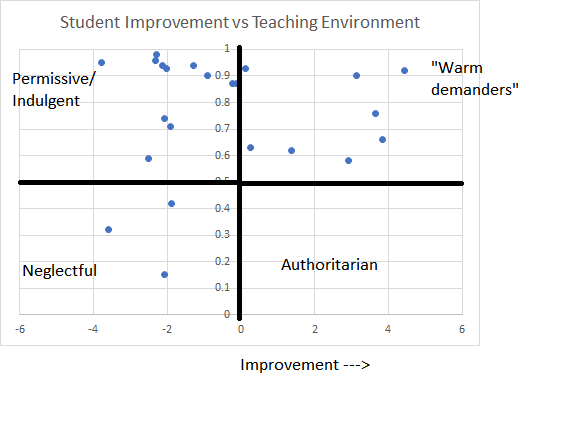
It's painful to look at and aesthetically violates everything we've learned in class, but it's still in a very early sketching phase!

# Data (original idea)

Unfortunately, while PPS has plenty of data on its website, none of it seems to be downloadable in a useful format. I scraped together this data manually into a spreadsheet from two sources:
1. The [Pennsylvania Value Added Assessment System (PVAAS)](https://pvaas.sas.com/schoolComparison.html?ab=aZ&as=l&aj=l&w4=93&xs=3&ww=86294&x9=3&yb=8&x7=1&xd=-3) website, which lists out each school in the district and scores it based on average student progress over the course of one year, and
1. The [A+ Schools Report to the Community](http://www.aplusschools.org/research-and-reports/report-to-the-community/), which I have both as a pdf and on paper. A+ Schools is a nonprofit watchdog organization for PPS that creates reports based on all the school data, including the information on teachers feeling the school is a good place to work and learn.
I am using PVAAS data as my metric for demandingness in a school, and A+ Schools' data on teaching/learning conditions as a metric for warmth. I will plot schools on a 2x2 matrix based on this data.

# Method and Medium (original idea)

The next steps have to be figuring out what patterns in the data are interesting or surprising enough to make a good story. I think there are almost certainly interesting stories in the data I've collected, but the ones I've discovered so far need some work with regards to framing in order to qualify as an interesting narrative, although "teachers are bad judges of learning environments" would certainly be provocative. I plan to keep playing around with the data, visualizing it, and connecting it with more qualitative personal experiences I've had at the schools.

Once I have more of a clear sense of my narrative, I will test different visualization methods like Datawrapper and Tableau in order to find one that displays it effectively. I like the 2x2 matrix, but it may not be appropriate for some stories I could choose to tell. The labels would also change depending on the story I settle on. If I did do "teachers are bad judges of learning environments," the quadrant labels would have more to do with false positives/false negatives than with warmth and demandingness.

After prototyping some charts, I will ask people to look at them and gauge whether they get the message and find it compelling before I start the final version.

I really like Shorthand as a tool for displaying data visualizations and the stories around them, so I plan to use that. I believe that format will allow me to easily incorporate some personal anecdotes from these schools in an engaging way. This is essential for a project like this, which deals with data only inherently interesting to a very niche audience (i.e. Pittsburghers interested in school reform/education policy). Without developing some curiosity or emotional connection among viewers, they will not care about my data visualization. Shorthand allows people to convey information in a way that is conducive to good storytelling by controlling what the viewer sees when, which I hope will help me accomplish this.

# Part II: Final Project Wireframes

Soon after completing Part I, I changed my mind about my topic, because the sample size was too small for me to make a strong claim.

I am now working on Southwestern Pennsylvania Elections in the Trump Era. I spent many hours exploring different aspects of election data from the region and noticed certain things:
* I started out looking at data for both presidential and gubernatorial elections. While I was able to notice certain trends, the data was pretty messy. But when I tried limiting it to just presidential elections, the data became extremely clean, with very visible (and thus visualizable) trends.
* The four Southwesternmost counties in Pennsylvania always vote as a bloc, within a few percentage points of each other, and could be combined into one average line without losing much data
* One theory that I looked at to explain 2016 was that Trump districts were full of racists, but I noticed that Allegheny County (the one blue district in 2016) was the county in the region with the most votes for third-party candidate George Wallace (the "segregation now, segregation forever!" governor of Alabama) at 11%, indicating that Allegheny County had more of a racist voting history than the rest of the region
  * The evidence about Wallace was contradicted by the 1976 Democratic primary, when Wallace was *less* successful in Allegheny Co. than in the other counties of the region, which led me to abandon that angle as the focus of my presentation.
* Finally, I noticed that 1984 was a very successful year for Democrats in Southwestern Pennsylvania, even though it was very unsuccessful in the state and country at large

Remembering many articles that talked about Trump winning because of "Reagan Democrats," those white working-class registered Democrats who voted for Reagan in the 1980s, I realized that this narrative did not fit the data in Southwestern Pennsylvania, a key region without which Trump would have lost the state.

Here's what I came up with (draft #3):
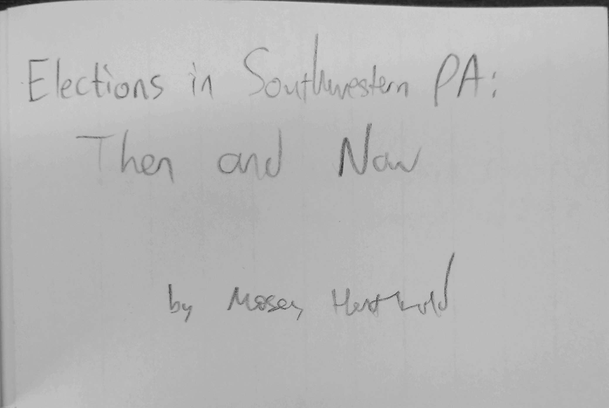
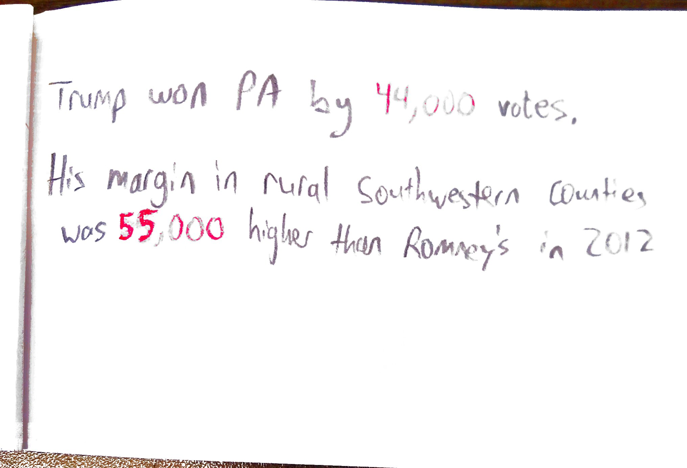
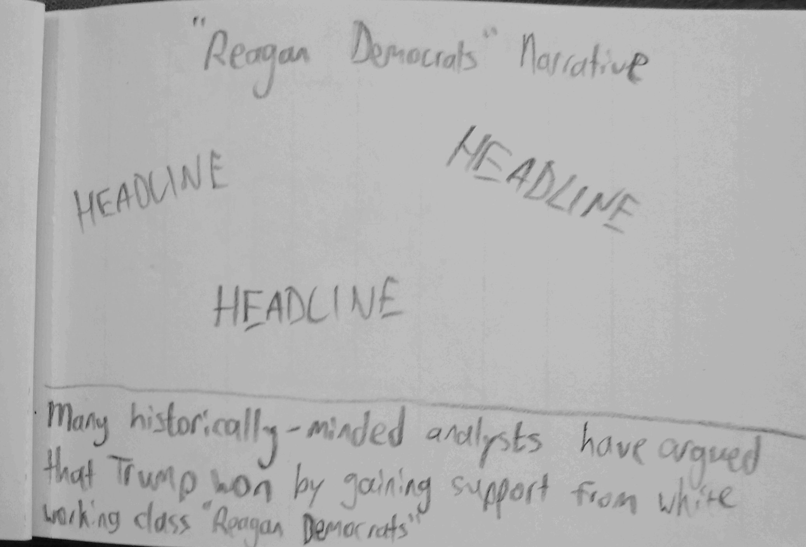
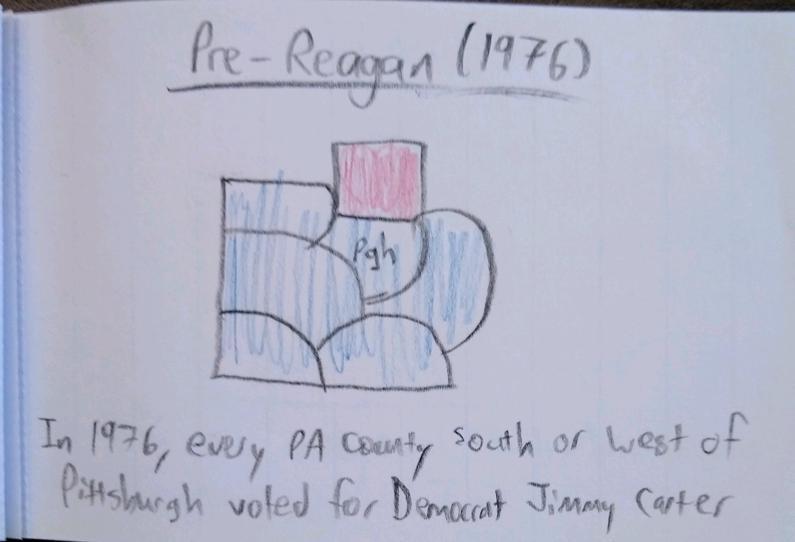
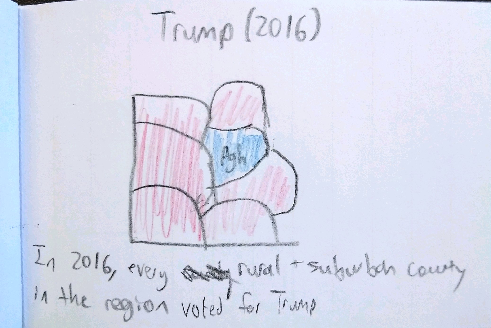
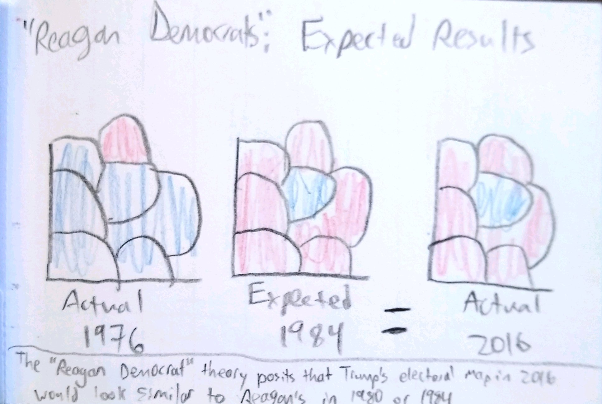
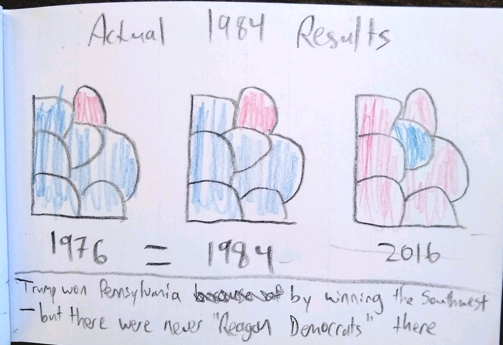
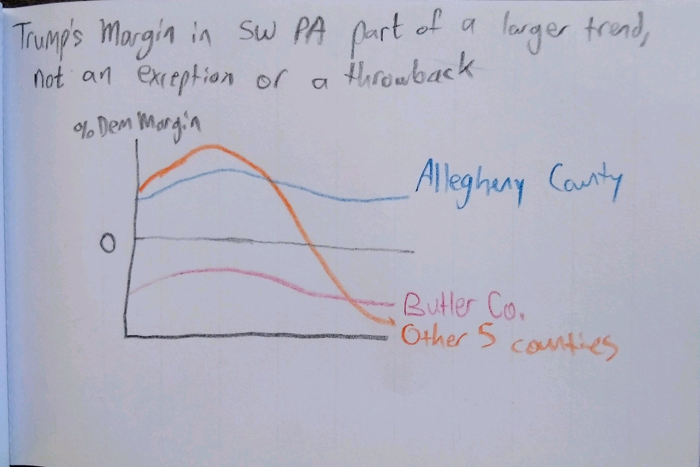
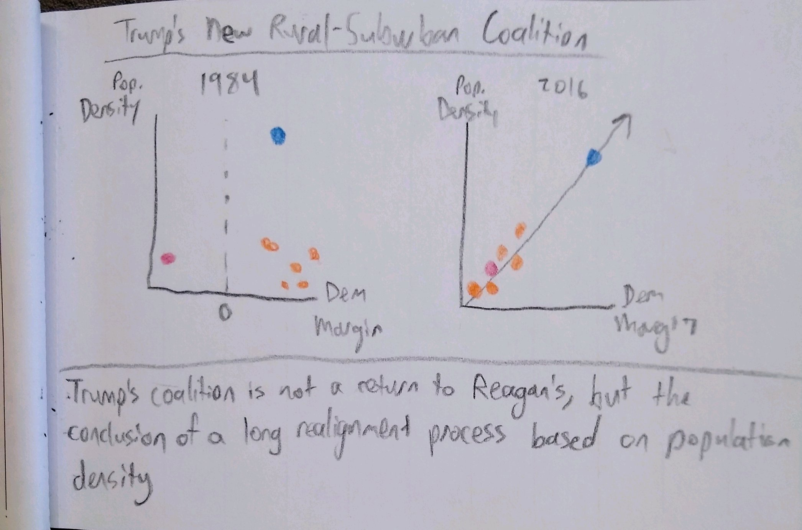
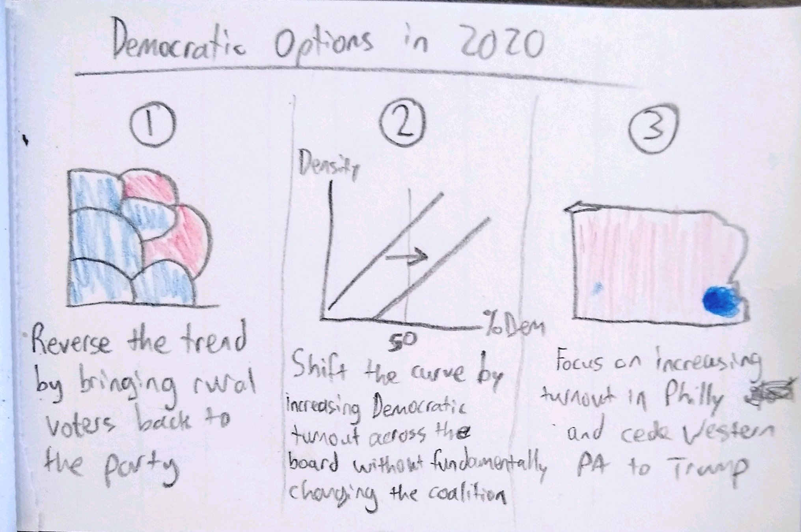

My target audience is Pennsylvania Democrats interested in understanding the 2016 election and thinking about tactics for 2020.
My first test user was not an American citizen and not particularly familiar with the intricacies of American politics. While he was not part of my target audience, his feedback was useful because I want my project to make sense to people who don't follow politics closely. My second and third test users were Heinz students who are registered Democrats. I asked them:
* What is this about? What is it trying to say?
* What surprised you?
* What confused you?
* What are you curious about?

From there, I allowed it to be a conversation with some back-and-forth. My first user liked the maps and density chart but had trouble discerning an overall message. My second user was confused by the phrasing of the first text slide about Trump's margin in these counties and by the 1984 expected results slide, which looked like it was representing real data when in fact it was theoretical (and contradicted by the next slide). He also noted that Democratic Margin was on the y-axis in one slide and the x-axis on the next, which was confusing. The third user wasn't sure what Butler County was doing in the graphs (I agree - it is distracting and politically very different from the rest of the region). He was confused by the labeling on some charts as well. Both the second and third user felt that the overall message was clear, and they otherwise found the visuals clear and compelling.

I made immediate changes based on some suggestions, such as switching the axes on Tableau to be consistent across graphs. I will also make the 1984 expected results map translucent with a big question mark to make it clear that it does not represent real results.

# Part III

## Intended Audience
I started out aiming at a target audience of Pennsylvania Democrats interested in 2020 tactics, but as I wrote the Shorthand, the target audience drifted out of state. Ultimately, my big takeaways were aimed at people who are interested in the 2020 elections from a Democratic perspective, but who may be unaware of the political dynamics of Southwestern Pennsylvania, a crucial area for presidential candidates. This audience may be in-state, but could also be out-of-state campaign workers and volunteers coming into the region who want a briefing on the area's presidential voting history.
My intended viewers have some basic level of understanding of national politics and geography, but lack area-specific knowledge, so I tried to include both surprises for an out-of-state viewer and action items for candidates and their volunteers. The biggest surprise that I included was that Southwestern Pennsylvania voted overwhelmingly for both Walter Mondale and Donald Trump, who are just about polar opposites. I think it's important for political strategists to note that an important region of Trump country voted fairly recently for a bland, mild-mannered liberal with a female running mate. Many Trump voters probably care less about the specific ideology or personality of a candidate than about whether they think that candidate cares about people like them.
I also included a takeaway tailored to this audience about Democratic tactics moving forward. I proposed three possibilities, based on the historical framework I put forth, based on whether the candidate wants to fight or embrace long-term trends (or something in between). While I left my readers to make their own choices, I did sound a note of caution about Option #3 (ignoring Western PA to focus on maximizing turnout in Philadelphia), because I believe such a strategy would ultimately be devisive and exacerbate the country's polarization and other political problems.

## Work Summary
Throughout the course of this project, a lot of things changed along the way. The biggest changes happened during the brainstorming/data exploration/wireframing portion of the project, as detailed in my Part II summary. I went down a lot of rabbit-holes, and spent a lot of time exploring options that I ended up discarding, such as the storyline around George Wallace's fairly high support in Allegheny County.
I wasn't very familiar with Shorthand while making my wireframes - I had read many Shorthand pieces, but never created one myself - and I quickly discovered that some things wouldn't turn out quite how I had imagined them.
One of the challenges that came up was that the interactive functionality of the Tableau charts could only be retained if they were embedded in the text, rather than images that could be scrolled through. Choosing between the Tableau interactive functionality and the Shorthand scrolling functionality was a difficult call. I ultimately did a combination of both, allowing viewers to scroll through the population density charts and to interact with the maps. Looking back on this, I much prefer the scrolling functionality to the (rather limited) interactivity, especially as my maps show change over time and would be a good fit for Shorthand's scrolling. I intend to go back and change that for my portfolio when I get the chance.
I also had a lot of trouble digitizing my vision for the final three images, namely the suggestions for future campaigns. Designs that had been simple to sketch were quite difficult in practice to produce digitally in an aesthetically consistent manner. I was ultimately satisfied with my use of the 2008 map for Option #1. The Option #2 chart mostly looked good, as it was aesthetically consistent with previous charts, but I could not figure out how to give it appropriate labels, or add an arrow to the chart to show upward movement. After some disastrous attempts to add arrows in Microsoft Paint, I ultimately decided to leave it arrowless and instead explain it in the accompanying paragraph. For Option #3, I had planned to show a map of Pennsylvania with Philadelphia highlighted in blue, but I had trouble making one and couldn't find any online (I found several with Philadelphia highlighted in red, but that would have been confusing in this context). In the end, I decided to instead use a picture of Philadelphia's City Hall, the building I personally most associate with Philly and a visual that could accomplish the same purpose.

## References
Presidential election data, 1972-2004: Allegheny College (https://sites.allegheny.edu/vta/pennslyvania-counties-archive/)
Presidential election data, 2004-2016: PA Election Returns (https://www.electionreturns.pa.gov/ReportCenter/Reports)
County population data: US Census (https://www.census.gov/content/census/en/programs-surveys/popest/data/data-sets.All.html/)
https://www.flickr.com/photos/whitehouse/48537036802
https://www.telegraph.co.uk/news/2016/11/09/the-reagan-democrats-have-returned-to-the-republicans---handing/
https://www.washingtonpost.com/news/powerpost/paloma/daily-202/2016/11/11/daily-202-the-reagan-democrats-are-no-longer-democrats-will-they-ever-be-again/58252889e9b69b6085905df0/
https://www.detroitnews.com/story/opinion/2016/11/14/reagan-democrats/93852740/
https://www.reuters.com/article/us-usa-election-trump-idUSKCN0SP0HX20151031
https://www.politico.com/story/2019/04/24/joe-biden-unions-2020-1289642
https://www.theatlantic.com/politics/archive/2016/03/the-myth-of-the-reagan-democrat/475608/
https://newrepublic.com/article/153939/democrats-victory-not-depend-swing-voters
https://www.salon.com/2016/05/10/there_are_no_reagan_democrats_the_gop_has_become_the_party_of_rich_white_southerners_partner/
https://www.rollingstone.com/politics/politics-news/walter-mondale-learning-to-live-with-fritz-63316/
https://www.flickr.com/photos/142588507@N05/43417667980
https://commons.wikimedia.org/wiki/File:Joseph_Biden_speaking_at_the_University_of_Pittsburgh.jpg
https://www.wtae.com/article/details-of-joe-bidens-campaign-visit-to-pittsburgh-announced/27268719
https://www.post-gazette.com/news/politics-nation/2019/04/14/Bernie-Sanders-strives-to-win-back-Pa-democrats-at-rally-in-Oakland-scheney-plaza-campaign-2020/stories/201904140178
https://www.wesa.fm/post/presidential-candidate-minn-senator-amy-klobuchar-visit-pittsburgh-wednesday
https://pittsburgh.cbslocal.com/2019/09/23/democratic-presidential-candidate-beto-orourke-pittsburgh/

